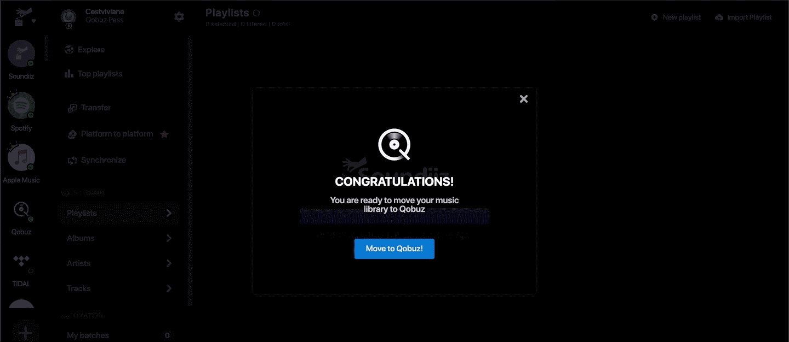

# Guide de migration à Qobuz depuis Spotify

## Pourquoi choisir Qobuz plutôt que Spotify ?

En migrant vers Qobuz, vous optez pour une plateforme basée en Europe (France) qui met davantage l'accent sur le respect des artistes et la qualité musicale.

### Qualité audio supérieure

La principale différence entre Qobuz et Spotify réside dans la qualité audio. Tidal propose :

- **Qualité CD** : audio sans perte en qualité CD (16-Bits, 44,1kHz)
- **Hi Res Audio** : qualité studio (24-Bits, 192kHz)

Comparativement, Spotify plafonne à 320 kbps en qualité MP3.

### Rémunération plus équitable des artistes

Qobuz verse généralement des redevances plus élevées aux artistes que Spotify. (Around $0.043 per stream vs $0.003 to $0.005 for Spotify).

## Étapes de migration

### 1. Créez un compte Qobuz

Si vous n'avez pas encore de compte Qobuz, rendez-vous sur le site officiel de [Qobuz](https://www.qobuz.com) et inscrivez-vous. Choisissez un plan qui vous convient.

### 2. Exportez Spotify vers Qobuz

Pour commencer, vous devez exporter vos playlists/artistes/albums de Spotify. Vous pouvez utiliser des outils tiers comme **[Soundiiz](https://soundiiz.com/)** (startup française) pour faciliter ce processus.

**Note importante** : La version gratuite de Soundiiz présente quelques limitations :

- Maximum de 200 titres par playlist transférée
- Une seule synchronisation active à la fois

**ℹ️ Cependant Qobuz offre un code promo pour migrer en utilisant Soundiiz**

Ce qui suit est la traduction d'un article complet existent en anglais [ici](https://help.qobuz.com/en/articles/58315-how-to-transfer-your-playlists-for-free-with-soundiiz)

### Créer un compte Soundiiz

- 1 : Allez sur Soundiiz et entrez le code `HELLOQOBUZ` dans la case prévue / vous pouvez aussi cliquer ici directement.
- 2 : Créez-vous un compte Soundiiz ou connectez-vous si vous en avez déjà un. Une fois votre adresse e-mail vérifiée et votre compte Soundiiz activé, cliquez sur "Go to the app".
- 3 : Connectez-vous à Qobuz avec vos identifiants habituels

### Démarrer la migration

- Une fenêtre pop-up noire vous demandera si vous souhaitez commencer la migration de votre musique vers Qobuz : cliquez sur "Move to Qobuz !"

- Lorsque la fenêtre pop-up s'ouvre, cliquez sur "Let's go !"

#6 Sélectionnez la plateforme source depuis laquelle vous souhaitez migrer votre musique et connectez-vous avec vos identifiants habituels pour cette plateforme.

### Sélectionner le contenu à migrer

#7 Choisissez les playlists, albums, artistes et morceaux que vous souhaitez transférer. Vous pouvez migrer l'intégralité du contenu en sélectionnant l'une de ces catégories ou manuellement en cliquant sur "Select items". Une fois votre choix fait, cliquez sur les catégories sélectionnées puis sur "Confirm my selection"

#8 Lorsque la fenêtre de résumé s'ouvre, si vous êtes satisfait de votre sélection, cliquez sur "Begin the transfer" pour démarrer le processus. Le transfert de votre musique va commencer !

Vous avez également la possibilité de revenir en arrière en cliquant sur la flèche en haut à gauche.

### Erreurs ou autres plateformes ?

#9 Vous avez fermé la fenêtre pop-up vous invitant à migrer votre musique vers Qobuz ? Vous avez des playlists sur différentes plateformes de streaming ? Oublié de transférer une playlist ? Pas de souci ! Vous pouvez redémarrer le processus en cliquant sur "Platform to Platform" à gauche de votre écran.
Le processus est similaire à celui décrit ci-dessus.
