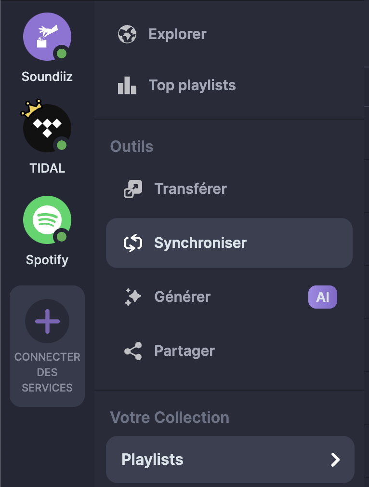
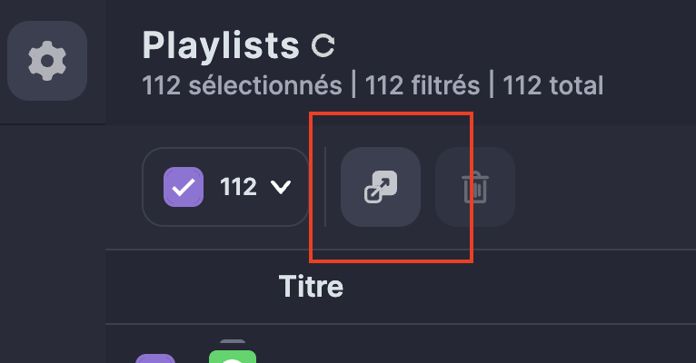

# Guide de migration à Tidal depuis Spotify

## Pourquoi choisir Tidal plutôt que Spotify ?

En migrant vers Tidal, vous optez pour une plateforme qui met davantage l'accent sur le respect des artistes et la qualité musicale.

### Qualité audio supérieure

La principale différence entre Tidal et Spotify réside dans la qualité audio. Tidal propose :

- **Tidal HiFi** : audio sans perte en qualité CD (1411 kbps)
- **Tidal Master** : qualité studio avec MQA (jusqu'à 9216 kbps)
- **Dolby Atmos et Sony 360 Reality Audio** : pour une expérience audio immersive

Comparativement, Spotify plafonne à 320 kbps en qualité MP3.

### Rémunération plus équitable des artistes

Tidal verse généralement des redevances plus élevées aux artistes que Spotify. Avec leur modèle de paiement "direct-to-artist", Tidal assure qu'une partie de votre abonnement va directement aux artistes que vous écoutez le plus.

## Étapes de migration

### 1. Créez un compte Tidal

Si vous n'avez pas encore de compte Tidal, rendez-vous sur le site officiel de [Tidal](https://tidal.com) et inscrivez-vous. Choisissez un plan qui vous convient.

### 2. Exportez Spotify vers Tidal

Pour commencer, vous devez exporter vos playlists/artistes/albums de Spotify. Vous pouvez utiliser des outils tiers comme **[Soundiiz](https://soundiiz.com/)** (startup française) pour faciliter ce processus.

**Note importante** : La version gratuite de Soundiiz présente quelques limitations :

- Maximum de 200 titres par playlist transférée
- Une seule synchronisation active à la fois

**Astuce économique** : Si vous avez beaucoup de playlists volumineuses à transférer, envisagez de souscrire à l'abonnement premium de Soundiiz pour un mois seulement (environ 4,5€). Vous pourrez effectuer tous vos transferts sans limitations, puis annuler l'abonnement une fois la migration terminée.

Voici comment faire :

- Connectez-vous à votre compte Spotify et Tidal sur Soundiiz.

- Allez dans Artistes/Playlist ou Albums, sélectionnez-les tous puis cliquez sur Transférer :

Documentation officielle : [documentation](https://soundiiz.com/fr/tutorial/spotify-to-tidal)

### 3. Migrez les artistes que vous suivez

Soundiiz offre également la possibilité de migrer les artistes que vous suivez :

- Dans Soundiiz, accédez à la section "Artistes suivis".
- Sélectionnez Spotify comme source et Tidal comme destination.
- Lancez la synchronisation pour transférer tous vos artistes favoris.

### 4. Configurez la synchronisation des playlists

Pour maintenir vos playlists à jour entre Spotify et Tidal pendant votre période de transition :

- Dans Soundiiz, allez dans la section "Synchronisation".
- Créez une nouvelle synchronisation en sélectionnant une playlist Spotify comme source et Tidal comme destination.
- Configurez la fréquence de synchronisation (quotidienne, hebdomadaire).
- Cette fonction est particulièrement utile si vous souhaitez continuer à utiliser Spotify occasionnellement tout en migrant progressivement vers Tidal.

**Note** : La synchronisation de playlists n'est disponible que dans la version premium de Soundiiz. Vous avez le droit à une synchronisation en gratuit, idealement pour le Discover Weekly?

**Important** : À noter que les recommandations de Tidal seront moins pertinentes durant les premiers mois d'utilisation, le temps que l'algorithme apprenne à connaître vos goûts musicaux.

**Important** : Contrairement à Spotify, Tidal se concentre uniquement sur la musique et ne propose pas de livres audio ou de podcasts. Si ces contenus sont importants pour vous, vous devrez utiliser des applications dédiées.

## Conseils supplémentaires

- **Qualité audio** : Tidal propose des options de qualité audio supérieure. Assurez-vous de configurer vos préférences audio dans les paramètres de l'application.

## Problèmes potentiels

- **Chansons manquantes** : Certaines chansons de Spotify peuvent ne pas être disponibles sur Tidal. Soyez prêt à ajuster vos playlists en conséquence.
- **Compatibilité des outils** : Assurez-vous que l'outil que vous utilisez pour la migration est à jour et compatible avec les deux services.
